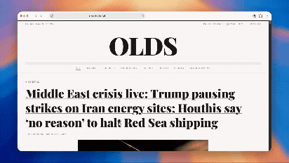
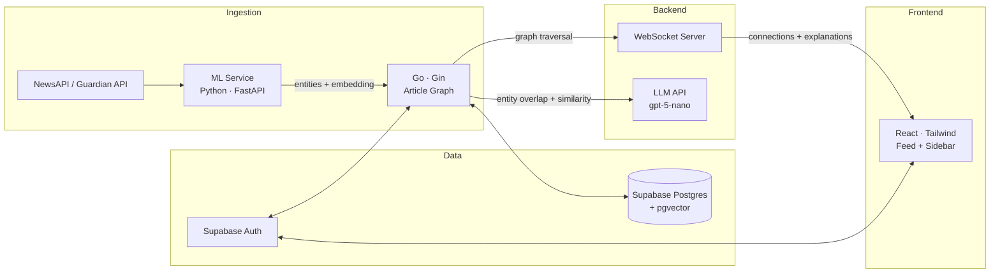

# Olds

**A news reader that show you non-obvious connections between stories across topics.**

🌐 [**readolds.fyi**](https://readolds.fyi)

---



---

Olds finds connections between news stories that don't belong to the same category. When you read an article about Iranian trade sanctions, the sidebar shows you a related crime story in Jakarta involving the same political actors — and explains *why* they're connected in plain English. The feed learns from how you read, not what you explicitly rate.

## How it works

Articles arrive from NewsAPI and The Guardian every 30 minutes. A Python service extracts named entities (people, places, organizations) and generates a 384-dimensional sentence-transformer embedding for each article. The Go backend stores both and builds an in-memory directed graph where edge weights combine cosine similarity of embeddings with named entity overlap, so two articles are connected both semantically *and* concretely.

When you open an article, Go traverses the graph in real time, filters for cross-topic neighbors above a similarity threshold, and pushes them to the browser over a WebSocket. An LLM then generates a 1–2 sentence natural language explanation for each connection, streaming results into the sidebar as they resolve. The feed ranking is shaped by implicit signals — dwell time, scroll depth, re-opens — with no explicit ratings.



## Metrics

| Metric | Value |
|--------|-------|
| Articles indexed | 500+ |
| Graph edges | 160,000+ |
| Cross-topic connection rate | ~68% |
| Enrichment success rate | >95% |
| Graph traversal (median) | TBD<!-- TODO: fill from /stats after 1 week --> |
| WebSocket push latency (median) | TBD<!-- TODO: fill from /stats after 1 week --> |
| ML inference per article (median) | TBD<!-- TODO: fill from /stats after 1 week --> |

## Local development

```bash
git clone https://github.com/parthkotwal/olds.git
cd olds
cp .env.example .env
# Fill in: SUPABASE_DATABASE_URL, SUPABASE_JWT_SECRET, SUPABASE_ANON_KEY,
#          SUPABASE_URL, NEWSAPI_KEY, GUARDIAN_API_KEY, LLM_API_KEY
docker compose up
```

Visit [localhost:3000](http://localhost:3000). The backend runs on `:8080`, ML service on `:8001`.

On first start the backend triggers an ingestion run. It takes 2–3 minutes to fetch articles, run them through the ML service, and build the graph. The feed populates automatically; no manual step needed.

---
Courtesy of Parth Kotwal